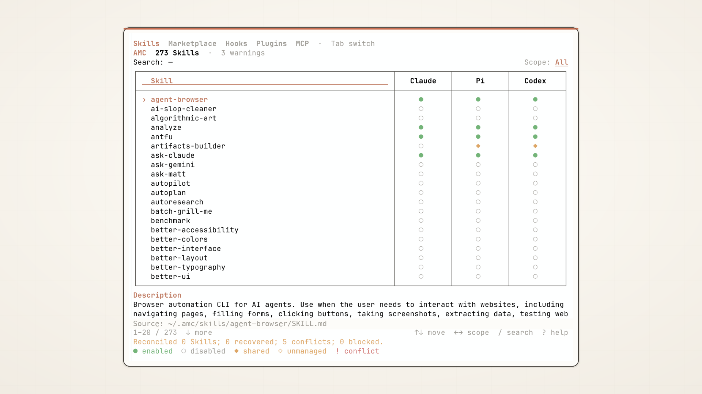
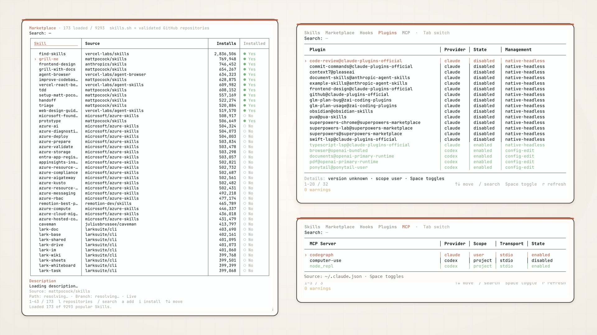

# AMC — Agent Management CLI

[简体中文](README.zh-CN.md)

<p align="center">
  
</p>

<p align="center"><strong>One terminal control plane for Claude Code, Pi, and Codex.</strong></p>

<p align="center">
  <a href="https://www.npmjs.com/package/@i-xor/amc"></a>
  
  
  
</p>

AMC manages Agent Skills, Hooks, Plugins, and MCP servers for Claude Code, Pi,
and Codex. It keeps one canonical Skill copy in `~/.amc/skills/`, links it to
each provider, and preserves originals before migration or configuration edits.

## Why AMC

- **One canonical Skill, independent provider control.** Reuse content without maintaining divergent copies.
- **Marketplace built in.** Browse skills.sh and validated public GitHub repositories, inspect descriptions, install, and check updates.
- **More than Skills.** Inspect and manage Hooks, Plugins, and MCP servers from the same keyboard-first TUI.
- **Fail closed.** Conflicts, local drift, unsafe remote entries, stale plans, and occupied paths remain visible instead of being overwritten.

<p align="center">
  
</p>

## Install

```bash
npm install --global @i-xor/amc
```

AMC supports **macOS and Linux only** and requires **Node.js 22 or newer**.
Windows junctions are not supported.

## Start safely

Begin with the read-only inventory and reconciliation preview:

```bash
amc list
amc reconcile
amc migrate --all
```

These headless previews do not create, move, or rewrite files. Apply safe
reconciliation explicitly in scripts with:

```bash
amc reconcile --apply --yes
```

Running bare `amc` opens the interactive TUI and automatically reconciles only
unambiguous user-level Skills. It scans `~/.agent/skills`, `~/.agents/skills`,
Claude, Pi, and Codex roots; atomically moves one selected directory into the
canonical store without copying its bytes; and replaces effective applications
with AMC-owned links. Shared roots become independent Pi and Codex links.
Divergent, foreign-link, invalid, stale, and occupied cases remain untouched and
visible for explicit source selection.

The older migration preview remains available, and divergent direct-provider
copies are never selected automatically:

```bash
amc migrate --all --yes
amc migrate writing-text --source claude
```

## Commands

```text
amc
amc list [--page <n>] [--limit <1-100>] [--search <text>]
amc list --all [--search <text>]
amc list --diagnostics [--page <n>] [--limit <1-100>] [--search <text>]
amc list --diagnostics --all [--search <text>]
amc enable <skill> [--target claude|pi|codex]
amc disable <skill> [--target claude|pi|codex]
amc migrate <skill> [--source claude|pi|codex]
amc migrate --all [--yes]
amc reconcile
amc reconcile --apply --yes
amc reconcile <skill> --source agents|agent|claude|pi|codex|canonical --apply --yes
amc search <query> [--source skills.sh|github]
amc auth github login
amc auth github set --token-stdin
amc auth github status
amc repos list
amc repos add <owner/repo> [--branch <branch>]
amc repos refresh <owner/repo>
amc repos enable|disable <owner/repo>
amc repos remove <owner/repo>
amc install <owner/repo> --skill <name> [--branch <branch>]
amc upgrade <skill>
amc updates check [<skill>]
amc delete <skill> --yes --confirm <skill>
amc plugins list [--page <n>] [--limit <1-100>] [--search <text>] [--all]
amc plugins enable|disable <plugin-id>
amc hooks list [--page <n>] [--limit <1-100>] [--search <text>] [--all]
amc hooks edit <hook-id>
amc hooks enable|disable <hook-id>
amc mcp list [--page <n>] [--limit <1-100>] [--search <text>] [--all]
amc mcp enable|disable <mcp-id>
amc --help
amc --version
```

Lists show 20 rows per page by default. `--all` emits the complete result and
search is case-insensitive. Redirected output has no ANSI styling. Skill enable
and disable operations target all three providers unless `--target` is given.
`shared` means Pi/Codex can discover a Skill through `.agent` or `.agents` even
when no provider-specific link exists. Headless commands never prompt: success
exits `0`, operational failures exit `1`, and invalid usage exits `2`.

### GitHub authentication

AMC supports GitHub OAuth through the official `gh` CLI and a manually supplied Token. OAuth mode requires `gh` to be installed separately; AMC never installs it automatically. If `gh` is missing, AMC prints platform-specific installation guidance, the retry command, and the Token alternative. OAuth credentials remain managed by `gh`; AMC stores only the selected method. Token input is accepted only through non-TTY stdin and is stored in `~/.amc/credentials/github-token` with mode `0600` inside a `0700` directory. `GITHUB_TOKEN` has highest priority. Authorization is sent only to `api.github.com`.

```bash
amc auth github login
gh auth token | amc auth github set --token-stdin
amc auth github status
```

Status reports the selected method, validity, remaining API requests, and reset time without printing credentials.

### Skill marketplace and lifecycle

`amc search` aggregates the public skills.sh registry with enabled GitHub repositories. The Marketplace TUI opens with the public skills.sh all-time leaderboard, incrementally loads subsequent leaderboard pages as selection nears the loaded edge, presents responsive result columns including canonical installation status with the same theme palette and selection treatment as other tabs, and lazily resolves the selected registry entry's GitHub description and provenance. Additions accept public `github.com` repositories only and are saved only after a bounded scan finds at least one `SKILL.md` with non-empty string `name` and `description` frontmatter. Root and nested Skills are supported; invalid entries are reported and skipped. Duplicate repository mirrors are resolved deterministically by preferring exact `skills/<name>` paths and then non-hidden directories; genuinely ambiguous sources remain blocked. Remote symlinks and submodules are never followed or installed: a nested Skill is rejected only when an unsupported entry is inside its own directory, while unrelated repository paths do not suppress safe descriptions.

Install resolves the selected repository, branch, relative path, and commit again before writing. Same-name Skills from another or unknown source never overwrite or auto-rename existing content. New installs remain disabled for every provider until explicitly enabled. `amc updates check [<skill>]` read-only checks one or all applied canonical Skills and reports current, update, local drift, untracked, or error states. Repository scans are reused by source; no staging or automatic upgrade occurs. Upgrade is available only for provenance-tracked installs and stops on any local content drift; v1 has no force mode.

`amc delete` is irreversible and is not the same as disable. Headless deletion requires both `--yes` and an exact `--confirm <skill>`. It removes canonical content, AMC-owned active/parked links, provenance, and recognized AMC backup/staging/failed copies. An interrupted deletion keeps a content-free journal and resumes on the next exact deletion request; already erased bytes cannot be restored. Foreign same-name provider entries are never deleted.

### Provider resources

- **Plugins:** Claude Code uses its native headless command. Codex updates
  `plugins.<id>.enabled` in its configuration with backup, atomic replacement,
  verification, and rollback. Pi packages are reported as `installed` because
  Pi exposes installation inventory rather than a package-level enablement
  state; their resources remain interactive through `pi config`.
- **MCP:** Claude Code user, local, and project definitions and Codex's native
  inventory are shown. Enable and disable preserve server definitions. Pi has
  no native MCP registry in AMC.
- **Hooks:** inventory never executes Hook code. The TUI previews the selected
  source with line numbers; `p` opens a scrollable full-file preview. Enable and
  disable park or restore JSON Hooks, or update Pi extension overrides. Editing
  temporarily hands the terminal to `$VISUAL`, then `$EDITOR`, falling back to
  `vim`, and returns to the same TUI. Invalid JSON remains visible and `u`
  restores the guarded pre-edit backup.

## TUI controls

| Key | Action |
| --- | --- |
| `Tab` | Switch Skills, Marketplace, Hooks, Plugins, and MCP |
| `↑` / `↓`, `j` / `k` | Move selection |
| `Page Up` / `Page Down` | Move one visible page |
| `Home` / `End` | Jump to the first or last result |
| `←` / `→` | Select All, Claude, Pi, or Codex scope |
| `Space` | Toggle the selected item in the active scope |
| `1`, `2`, `3` | Toggle a Skill for Claude, Pi, or Codex |
| `/` | Start live search |
| `Enter` | Accept the current search |
| `Esc` | Cancel, close help, or clear search |
| `m` | Review Skill migration; choose sources with `1`/`2`/`3` and confirm with `y` |
| `c` / `C` | Check the selected Skill / all applied canonical Skills for updates |
| `u` | Upgrade the selected provenance-tracked Skill; restore a failed Hook edit |
| `d` | Permanently delete the selected Skill with warning and exact-name confirmation |
| `/`, `a`, `i` in Marketplace | Search, add a validated GitHub repository, or install the selected result |
| `e` | Edit the selected Hook source |
| `p` | Open or close the full Hook source preview |
| `r` | Refresh inventory |
| `?` | Toggle keyboard help |
| `q` | Quit |

Resource views use `Space` only where the provider supports a bounded toggle.
Pi interactive plugin resources display guidance instead. AMC limits visible
rows to fit the terminal and shows a resize message below 44 columns or 10 rows.
Set `AMC_THEME=dark`, `AMC_THEME=light`, or `AMC_THEME=mono`; `NO_COLOR` always
selects mono.

## Safety and credentials

AMC is conservative around provider-owned state:

- inventory, migration previews, and `amc reconcile` previews are read-only;
- bare interactive TUI startup is the only implicit safe-reconciliation path;
- reconciliation atomically moves the selected source to canonical and moves every non-selected original into a unique backup root;
- when canonical is valid, an explicit repair can archive invalid or broken shared/provider entries and recreate managed links without replacing canonical content; existing parked links remain disabled, and duplicate AMC-owned active/parked links are safely archived back to one consistent state;
- configuration writes use exclusive temporary files, backups, verification,
  and restoration when verification fails;
- stale plans, conflicting paths, invalid records, and unsupported entries stop
  the operation instead of being overwritten;
- AMC never automatically removes backups, parked links, or failed artifacts, except exact Skill-owned copies during explicitly second-confirmed permanent deletion;
- MCP environment values, headers, OAuth tokens, and other credentials are not
  included in list output;
- Hook inspection reads source metadata but never executes Hook code;
- editor commands are tokenized and launched without shell evaluation.

Do not paste credentials, tokens, private configuration, or sensitive paths into
issues. See [Security](SECURITY.md) for confidential reporting.

## Filesystem layout

```text
~/.amc/
├── skills/<skill>/
├── backups/<operation>/<target>/<skill>/
├── backups/<operation>/links/<target>/<skill>
├── backups/<operation>/staging/<skill>/
├── backups/<operation>/sources/<source>/<skill>/
├── disabled-links/<target>/<skill>
├── disabled-hooks/<hook-id>.json
├── credentials/github-token
├── github-auth.json
├── marketplace.json
├── skills-lock.json
├── delete-journals/<skill>.json
├── reconcile-journals/<operation>.json
├── staging/<operation>/<skill>/
└── failed/<operation>/
```

Canonical Skills are linked into:

| Provider | Skill directory |
| --- | --- |
| Claude Code | `~/.claude/skills/` |
| Pi | `~/.pi/agent/skills/` |
| Codex | `~/.codex/skills/` |

Disabled Hook records are owner-only files. Successfully restored records and
failed write attempts are retained with descriptive suffixes rather than
silently removed.

## Recovery

Each Skill migration is transactional. AMC stops bulk migration on the first
unexpected failure, reports completed and pending entries, and can be rerun from
a fresh inventory. If rollback encounters a newly created object, AMC preserves
both sides and reports exact recovery paths. Inspect the reported backup or
`failed` operation root before making manual changes; never replace it without a
separate backup.

Permanent deletion is intentionally not rollbackable. If it is interrupted, rerun the same exact delete command to resume the journaled pending paths; do not manually reuse or edit the journal.

For configuration changes, AMC reports the backup path. A failed confirmation
normally restores the original automatically. If restoration itself fails,
leave both files untouched and follow the paths in the error message.

## Architecture

```text
src/cli/           command parsing, help, formatting, and headless execution
src/tui/           Ink components, Skill and resource views, keyboard state
src/core/skills/   Skill scanning, toggles, migration, install, upgrade, delete, and recovery
src/core/marketplace/ public registry/GitHub discovery, validation, cache, and provenance
src/core/resources/ provider resource models, persistence, Plugins, MCP, Hooks
src/presentation/  terminal theme and color roles
src/runtime.ts     injected provider commands and editor launching
```

CLI and TUI code consume the same typed core operations. Provider commands and
editor launching are injected through the resource runtime. Pure presentation
and TUI view helpers do not access the filesystem.

## Development

```bash
npm ci
npm run lint
npm run typecheck
npm test
npm run coverage
npm run build
npm pack --dry-run
```

`npm run build` emits production files under `dist/src/`; test builds place
compiled tests under `dist/test/`. Tests use isolated temporary homes and do not
write to the current user's provider directories.

## Project policies

- [Contributing](CONTRIBUTING.md)
- [Security](SECURITY.md)
- [Code of Conduct](CODE_OF_CONDUCT.md)
- [Changelog](CHANGELOG.md)

AMC is licensed under the [Apache License 2.0](LICENSE). See [NOTICE](NOTICE)
for attribution.
